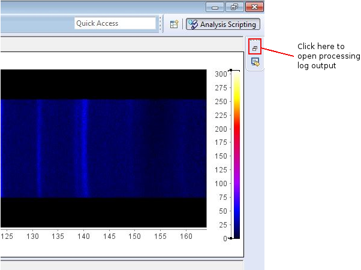

= Echidna User Manual

== Starting up

Refer to the starting up checklist in the Appendix. Usually this will be performed
by the instrument scientist.

== Placing the sample on the instrument

(See also checklist in Appendix)

Sample height may be checked using the neutron camera stored at the
base of the goniometer stage.  The photograph (not yet supplied) shows
how it looks when installed. Note that the power and camera cables can
easily slip out, so check that they are fully inserted after
positioning the camera.  Verify that the green light on the control
box is flashing (with an interval of several seconds, be patient).

The camera viewer program is executed using the 'D' icon in the Windows
taskbar of the computer. No other action should be necessary.

== Driving Echidna

The Echidna instrument is driven by a server program known as
'SICS'. 'SICS' is responsible for all aspects of instrument operation,
including positioning components, starting and stopping the count,
reading off measurements, and writing everything into the raw data
file.  Users can send commands to SICS, and a sequence of SICS
commands can be stored in a 'batch file' to automate a series of
operations.

Data are collected by running SICS scan commands.  Every time a SICS
scan is run, a raw datafile is generated named `ECHnnnnnnnn.nx.hdf`,
where `nnnnnnnnn` is an 8 digit number that increments after every
scan.

Echidna uses the 'Gumtree' interface to talk to SICS. Gumtree running
on Echidna is split over two large windows: 'Experiment' and
'Analysis'.

== Running an experiment

The various areas of the Experiment window referred to below are shown
in Figure 1.

image::gumtree_overview.png["Figure 1",align=left,title="Gumtree experiment window"]

[NOTE]
Room temperature experiments replace the file editing area with
a GUI for setting up multiple sample runs - see below.

=== Initial configuration and sample investigation

Initial scans are run to check that no stray pieces of sample
environment are contributing to the diffraction signal (not necessary
for RT) and assess the required counting time and sample quality.

At this stage individual SICS commands are entered at the 'SICS input
line'. A selection of useful commands is given below.

`samplename my great sample name`:: Set the name of your sample (in
this case, "my great sample name"). This will be stored in the output
file and displayed in the analysis file selection window. Spaces
within the sample name are acceptable.
`user username`:: Set the name of the user. This is stored in the file.
`runscan stth start stop npoints time nnn`:: Collect `npoints`
datapoints by stepping the detector from `start` to `stop` inclusive, measuring for `nnn` seconds at each point.
For a quick scan, a good choice is `start` = 4.0, `stop` = 5.125, `npoints` = 10. For a proper data collection,
a good choice is `start` = 2.75, `stop` = 5.2, `npoints` = 50. Counting time depends on your sample, and may be
anything from 60 to 1200 or more. The total counting time for a scan is `(nnn+13)*npoints`. 

`runscan stth 2.75 5.2 50 time 131`::: collect for two hours with a 0.05 degree step
`runscan stth 4.0 5.125 10 time 60`::: collect for 12 minutes (one minute per point) and 0.125 degree step

`hlist -val /sample/tc1/sensor/`:: List useful things about temperature controller one (e.g. temperatures and
setpoints of all sensors). Also usually available in the status display.

=== Setting up a multi-sample room temperature run

A facility for auto-generating multi sample room temperature runs can be chosen by clicking on the 'Room temperature'
button at the top right (see Figure 1).  A form appears at the top left.  After filling in the field,
click 'Add to Queue' and a pre-prepared batch file will be inserted into the 'buffer queue' (see following
section).  Press the 'Play' button in the batch buffer queue to start data collection.

image::RT_setup.JPG["Figure 2",align=left,title="Room temperature setup"]

Advice and additional information about the fields in the form:

Sample description:: This is used as an internal shorthand to describe the instrument setup. `mtth140-noPC` never
changes. `noSC` or `SC10` refers to the secondary collimator (out or in respectively). `Ge335`
is used for 1.62A, `Ge311` for 2.41A wavelength. `VacCh` means the RT vacuum chamber is being used.

Sics Script:: Usually unused

Sample name:: This is stored in the raw data file, and used when displaying files for data processing.
The sample name (up until the first space) can optionally be appended to the output filename.

Sample shape:: '9' or '6' for a sample in a 9mm or 6mm vanadium can, respectively.

Sample position:: The position of the sample in the robot tray. Always tray 'B'.

Overlaps:: How many __extra__ times to scan each angular position. '1' or more is recommended for the best
quality data.

Step size:: Angular separation of measurement points. 0.05 and 0.125 are common. The Echidna collimators
have an acceptance of 0.083 degrees.

The 'plus' symbol at the end of each line adds a new line, duplicating the values on the current line.

=== Setting up a batched run

A `batch file` is simply a sequence of commands that could have been
typed into the SICS terminal. To create a batch file, either use the
'File selection area' to create or copy a file (right click in the
area for choices) and then double-click to edit it, simply putting
in the commands that you would execute at the command line. Alternatively, you
could edit a text file using your favourite Windows text editor. The
completed file should be saved, and then dragged and dropped into the
_buffer queue_. Dragging and dropping from other Windows applications
(e.g. file explorer) is also OK.

Some commands (in addition to those given above) that are useful for batch files include:

`drive <something>`:: The `drive` command will request `<something>` (which could be a motor,
or a temperature, or a magnetic field) to go to a new value, and the next command will
not be accepted until this value has been reached. This way you can be sure that e.g.
the measured temperature has reached the target value before you start a scan.
`wait nnn`:: wait `nnn` seconds. Useful to allow temperature to equilibrate

Once you've dragged your file to the _buffer queue_, pressing the 'play' button will start execution.
Check the Log area immediately to the right of the buffer queue for any error messages.  The
_Big Red Stop Button_ can be used to stop batch file processing, and/or to interrupt the current scan.

[NOTE]
The Big Red Stop Button will immediately interrupt whatever
is running. It will not be possible to continue a batch file from the
point at which it stopped, so you will probably need to edit the batch file
before restarting.

=== Monitoring progress

A web page is available to watch the data accumulating at each step, and the status panel gives
information about temperatures, current sample name and count rates.  The plot at the bottom of
the Gumtree Experiment screen can be configured to plot most quantities tracked by SICS. Use
the green button to zoom out of the plot, and the notepad+arrow icon to send the plot contents
to the electronic notebook (see below).

Mobile-phone optimised status is available worldwide at
http://www.nbi.ansto.gov.au/echidna/status/mobile.html[the Echidna Status Page]

=== Finishing an experiment

See the checklist in the appendix.

== Processing data using Gumtree

Processing of Echidna data is carried out in the 'Analysis' window
(Figure 3).  Files are loaded into the 'File selection area' using the
"plus" icon, and after setting processing parameters in the 'Data
processing configuration' area, one or more files are selected and
the 'Run' button pressed.  The composite 2D image is displayed in
Plot 1, and the final result in Plot 2. Plot 3 is used as a scratch
area where different scans can be compared.

image::analysis_explanation.png[title="Echidna Analysis window",scaledwidth="50%",align=left]

The 'Processing output log' may be minimised, in which case an icon
will appear to the right (Figure 4) that can be clicked on to
restore the log.

=== Explanation of processing parameters

The data processing area is divided into sections (with dark blue headers),
each of which has one or more parameters.  In order, they are:

Copy datasets:: Pressing the button at any time will transfer the contents
of Plot 2 to Plot 3. If you want this to happen automatically (for example,
you are extracting many datasets simultaneously and want to see/compare
them immediately) tick the 'auto copy' box.

Output Format:: If any format box is ticked, a pdCIF file will also
be generated containing all data reduction parameters and as full
a description as possible of all transformations applied to the
raw data. This file should allow complete reproducibility of
data processing.

List of formats;;
XYD::: 3 column ASCII- Angle, intensity, uncertainty in intensity
No XYD header::: as above, with no comments or column headers at top of file
GSAS FXYE::: GSAS FXYE format (see GSAS manual for details)
Topas::: Topas format (XYD format with exclamation marks for comments)

out_folder;; the folder in which the output files will be stored. A folder
should have been created for you when the experiment started

Output filename:: The output file will be named ECH00NNNNN_xxxx, where
xxxx is entered into the box. The special characters '%s' if present, will
have the sample name substituted. So if your samplename is 'tnt_01' and
you enter `%s_10K` here, the filename will be `ECH0012345_tnt_01_10K.xyd`
with the extension dependent on the file format chosen.  Another shortcut
is `%t1` which will have the average temperature of the CF7 top thermocouple
inserted at that position.

Normalisation:: This should always be applied.
Source;; Monitor 1 is in the
guide after the monochromator and should not be used. Monitor 2 is
after the sample, and Monitor 3 is between the monochromator and
the sample. Generally Monitor 2 or 3 give the same results and are
the best choice.
Common to all datasets;; If multiple datasets are processed together
and this box is ticked, all datasets are normalised to the same
monitor counts. Otherwise, the steps in each dataset are normalised
independently of the other datasets.
Plot all;; Plot all of the monitor values for the most recently
selected dataset in Plot 2
Plot;; Plot counts for the selected monitor and dataset in Plot 2

Background correction:: This should not generally be used

Vertical tube correction:: This should be applied and the default value
will be correct

Efficiency correction:: This should be applied and the default value
will be correct

Horizontal tube correction:: This should be applied and the default
value will be correct

Assemble frames:: If one or more frames should be ignored (e.g. the
beam was down temporarily) they can be entered here in the format
`a:b,c:d` to exclude all frames from a to b and c to d (including b and d).
The output at the end of this step is displayed in Plot 1

Vertical integration:: Parameters for summing the image in
Plot 1 in the vertical direction
Lower limit;; minimum pixel to include, no less than 24 is recommended
Upper limit;; maximum pixel, no more than 104 is recommended
Treatment of close points;; due to detector misalignment and slight
differences in detector scan step size, if each
point is scanned more than once (the usual situation), each measurement
of a point will be at a slightly different position.  This can be
treated in the following ways:
Sum::: the position is averaged and the sum of the counts output
Merge::: the position and counts are averaged
None::: no merging is performed and all points are output
Rescale;; the dataset is scaled so that the number entered in
'Rescale target' is the maximum observed intensity

Recalculate gain:: Overlapping measurements are used to refine
relative gain of each separate detector tube.
Iterations;; number of refinement cycles. 5 is usually sufficient
Store gain result;; the results can be stored in a file for use
on datasets that do not have overlapping measurements
Load gain from file;; instead of refining gain, the gain values
found in the file generated by a previous store operation are used

Sum 1D datasets:: This is a toolbox operation, that is, it is not
executed unless the button is pressed. The sum of all datasets in Plot 3 after
will be displayed in Plot 2 when the 'Sum datasets' button is pressed, as well as the
result being written to the file given in `plh_file`.
plh_sum_type;;
Ideal::: All points in each dataset are assumed to be at their
ideal positions and intensities summed accordingly
Cluster::: Points within `plh_cluster` of each other have their
positions averaged and intensities summed
Merge::: All points are simply put into a single file, with no
merging.

Delete 1D datasets:: the selected datasets in Plot 3 are removed when
the delete button is pressed.  Note that datasets are referenced by
their datafile number and generation time.

Plot settings:: Plot 1 or 2 can be displayed in d spacing. Unselect
the tick box to return to 2-theta display.

Consult the Echidna paper (in preparation) for more details on each
of these processes.

== Solutions to common problems

[qanda]
How do I start Gumtree?::
If Gumtree inadvertently closes, this will not affect any data collections that are running. Find
the Gumtree icon on the desktop, and double click to execute. After a while you should be returned to
a familiar screen.
I'm not getting an image from the neutron camera::
Check that the power cable at the back of the camera is fully inserted (green light on camera control box
slowly flashes) and that the camera cable is fully inserted. Check that the camera is actually in the
beam.
I press 'Run' to run data processing, and nothing happens:: There is
probably an error during processing. Make sure you have the processing
output terminal open, and press 'Run' again.  Errors will produce Red
text in the output terminal.  Common mistakes include non-printing
characters in filenames after restarting Gumtree (check all filenames
in the processing configuration panel), or attempting
gain rerefinement when not enough frames have been collected.

== Appendix: Checklists
=== Experiment startup
* Experiment safety sheet in place?
* `prop-scheduler` run to change experiment number?
* Electronic logbook initialised to new page?
* mom/mchi/mf1 set to correct values for wavelength?
* Correct length snout installed?
* Slits set appropriately?
* Primary/secondary collimators in/out as required?
* Goniometer stage at sx/sy/schi/sphi = zero?
* Sics configured for correct sample environment?
* Sics communicating with sample environment?
* User batch file directory created?
* User analysis output directory created?
* Data processing configured with appropriate values?
* Have users put a barcode on their samples?

=== Sample installation checklist

==== Room temperature
* Is the V can or lid labelled with proposal number/user name/sample name?

==== CF7
* Is the sample holder labelled with proposal number/user name/sample name?
* Has the height of the sample been indicated on the can?
* Is the sample stick the right length (755mm or 755mm+25mm with spacer from the base of the top flange)?
* Do the temperature sensors work?
* Do all heaters work?
* If a C bracket is used, has the position of the vertical section been
marked on the top of the stick for reference?

* If working only below RT
** Has a Cd shield been attached?

* If working above RT
** Has all Cd been removed from the sample stick and sample mount? (It will vaporise)
** Have the slits been set to avoid the beam hitting the bottom of the copper C bracket?
** Has an Al heat shield been installed (recommended)?
** Is there sufficient heatsink compound on the lid and base?
** If the sample is sealed, could it become overpressurised and explode? Consider evolution of water.

==== Vacuum furnace
* Is the sample holder inert with respect to anything the sample might evolve at high temperature?
* Will the sample holder and attachment wire survive the maximum temperature?
* Is the stick at the right height (xxx mm from the base of the top flange)?
* If sample is sealed:
** Could it become overpressurised?
* If sample is not sealed:
** Could the powder sample be extracted by the vacuum pump?
* Is the temperature sensor type correct?

==== Magnet
* Are all screws non-magnetic?
* If the sample will have a net magnetic moment (ferro/ferri-magnetic), has it been suitably immobilised?
** Suggestions:
*** Cd disk inside can on top of sample, held in place by a Cd cylinder jammed in by lid.
*** Heavy water (freezes) or fluorosilicate (forms gel)
* Is the sample holder labelled with proposal number/user name/sample name?
* Has the height of the sample been indicated on the can?
* Is the sample stick the right length (1xxx mm from the base of the top flange)?
* Do the temperature sensors work?
* Is the correct input sensor (1 or 2) plugged in?

=== Checklist before executing a long run
* Is the sample name correct for each scan?
* Have temperature setting commands been verified to work?
* Are the correct temperature loops referenced (tc1_driveable/tc1_driveable2 etc.)?
* Are the necessary heaters enabled?
* Is the beam open?

==== CF7 (below RT)
* Have you added exchange gas to the sample space?
* Does your time estimate include cooling?
* Have you set your cold head temperature to your desired sample temperature at
each measurement point?

==== CF7 (above RT)
* Is the cold head temperature fixed at 300K for the whole time?
* Is the sample under rough vacuum? (It should be)
* Does your time estimate include cooling?

=== Magnet
* Is the temperature controller in remote mode?

=== End of experiment checklist
* Have all samples that are no longer radioactive been unloaded and submitted for clearance?
* Have all samples that are still radioactive been labelled and placed in the radiation safe?
* Is the instrument scientist aware of all samples in the radiation safe?
* Is the instrument scientist aware of any samples that are still in sample environment?
* Is the online experimental logbook up to date?
* Has all data been processed and transferred to appropriate storage?
* Has a PDF copy of the online logbook been generated?
* Has `prop-scheduler` been run to terminate the current experiment?

== About this document

This document is maintained in plain-text http://asciidoc.org[Asciidoc] format, from which HTML and
printed versions are created.  The source version may be viewed at
http://github.org/Gumtree/Echidna_scripts/Manual/user_guide.adoc[Github]

Please annotate the printed version in the cabin with corrections, or else use Github to clone the
manual and send a pull request after editing the raw text.
